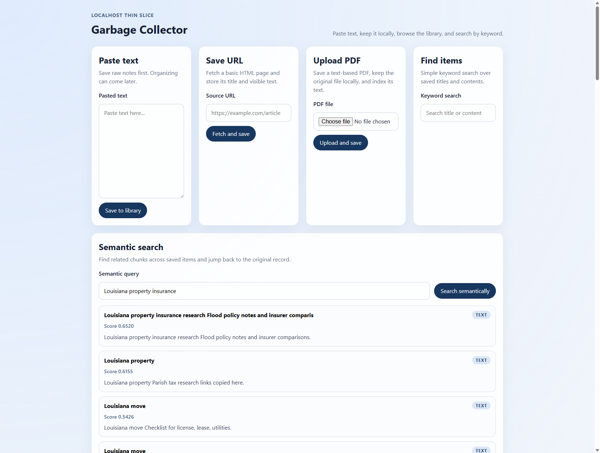
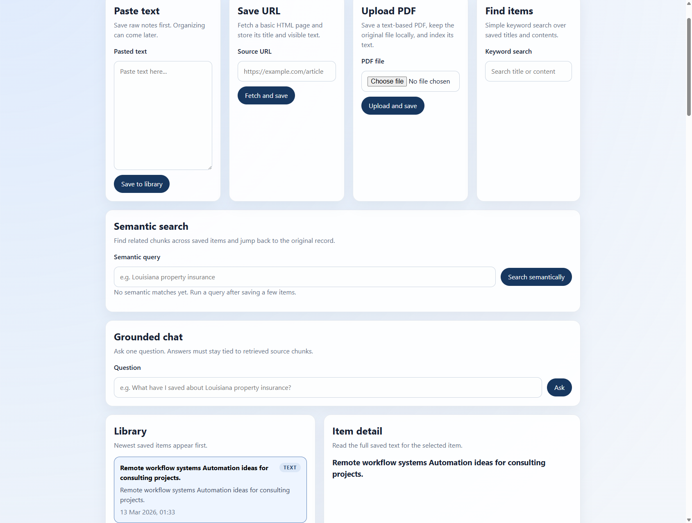

# Garbage Collector

Garbage Collector is a local-first personal intelligence system that ingests notes, links, and documents into structured searchable memory.

The current implementation is a localhost web app used to prove the core engine in small, frozen phases before adding richer interaction layers.

## Thin slice

This first slice intentionally includes only:

- pasted text ingestion
- URL ingestion
- PDF ingestion
- chunking
- local sentence-transformer embeddings
- semantic retrieval
- grounded chat
- local storage with SQLite
- library/list view
- item detail view
- keyword search

This slice intentionally excludes desktop packaging, OCR-heavy PDF handling, autonomous agents, clustering, and images.

## Product Direction Note

This repository is currently building the core engine and a thin localhost web shell first.

The intended later product direction is a desktop-style drag-and-drop experience with a stronger personality layer. That future direction may include:

- a central drag-and-drop target
- a "trash man" or garbage can visual identity
- simple ingest animations on drop
- occasional speech-bubble notifications for meaningful findings
- nudges tied to detected patterns, recurring themes, or user-defined interests and goals

This is a design-direction reference only.

Do not implement that layer yet. For now, keep building the core engine and basic UI, and preserve the architecture so a richer interaction layer can be added later without rewriting the backend.

## Folder Structure

```text
backend/
  app/
    main.py
    db.py
    models.py
    schemas.py
    crud.py
  tests/
  requirements.txt

frontend/
  src/
    api/
    components/
    types/
    App.tsx
  public/
  package.json

README.md
```

## Roadmap

- Phase 1: pasted text ingestion, local storage, library/detail view, keyword search
- Phase 2: URL ingestion with basic HTML fetching and text extraction
- Phase 3: PDF ingestion for text-based PDFs with local file storage
- Phase 4: conservative metadata and entity extraction for item detail view
- Phase 5: chunking, local embeddings, and semantic retrieval
- Phase 6: grounded chat over retrieved chunks with cited sources
- Phase 7: related items with simple why-related previews
- Future phases: agent access, image ingestion, and a stronger desktop-style interaction shell

## Current Verified Status

Thin-slice phase 7 is complete for pasted text, narrow URL ingestion, narrow PDF ingestion, conservative metadata/entity extraction, local semantic retrieval, grounded one-shot chat, and related items.

## Semantic Retrieval Demo



## Grounded Chat Demo


## Related Items Demo



Verified working:

- backend starts locally and serves the API
- frontend starts locally through Vite
- create item works from the browser UI
- URL save works for basic HTML pages
- URL save has been verified against simple static pages including `http://example.com` and `https://example.com`
- PDF upload works for text-based PDFs
- PDF upload has been verified with multiple text-based sample PDFs
- extracted metadata persists for `pasted_text`, `url`, and `pdf` items
- extracted entities persist for `pasted_text`, `url`, and `pdf` items
- chunk rows persist for `pasted_text`, `url`, and `pdf` items
- local sentence-transformer embeddings persist for chunk rows
- library refreshes after create
- the newly created item auto-selects
- the detail panel updates for the selected item
- URL-backed items show their source URL in detail view
- PDF-backed items show their original filename in detail view
- item detail view shows extracted metadata and conservative entities
- item detail view renders cleanly when no conservative entities are detected
- keyword search filters the library
- search works across `pasted_text`, `url`, and `pdf` item types
- semantic retrieval returns ranked chunk matches with scores and source item links
- semantic retrieval has been verified through the browser UI and the live API
- grounded chat returns an answer plus cited source chunks when an LLM adapter is configured
- clicking a chat citation opens the cited item detail view
- grounded chat fails gracefully with a readable message when no LLM is configured
- related items return ranked similar items with inspectable why-related previews
- clicking a related item opens that item detail view
- schema upgrade has been verified against an older SQLite database shape
- backend test suite currently passes with 20 tests
- backend-down failures show a readable message
- malformed URLs return a readable validation error
- unreachable URLs return a readable fetch error
- unreadable or textless PDFs return readable extraction errors
- repeated PDF uploads with the same original filename are stored under unique local file paths
- missing items return a readable `Item not found.` error
- the live browser app loads without obvious console/runtime errors in normal use

Verified on 2026-03-13 with a live FastAPI server, a live Vite dev server, real browser interaction, backend tests, a small varied URL check, multiple text-based PDF uploads, a live semantic-retrieval query, a live grounded-chat flow using a local fake OpenAI-compatible adapter, and a live related-items verification on the upgraded embedding base.

Not built yet:

- image ingestion
- desktop packaging
- multi-turn memory
- agents or autonomous loops
- clustering or bespoke engines

Current grounded chat limits:

- grounded chat is single-turn only in this phase
- answers are built from retrieved chunks only and do not maintain conversation memory
- one OpenAI-compatible adapter is wired for this phase through environment variables
- if no LLM is configured, the backend returns a readable error instead of guessing
- the model must return citation ids that map to retrieved chunks, and unknown citation ids are discarded
- the current demo and live verification use a fake local adapter; real hosted or local model backends can be swapped in behind the same adapter boundary

Current semantic retrieval limits:

- chunking uses fixed-size overlapping text windows rather than token-aware segmentation
- embeddings use `sentence-transformers/all-MiniLM-L6-v2`, which produces 384-dimensional vectors
- the first use of the embedding model may download model files locally before chunk indexing, semantic retrieval, or grounded chat requests become ready
- Sentence Transformers uses the Hugging Face cache by default unless you set `SENTENCE_TRANSFORMERS_HOME` or `HF_HOME`
- the backend logs first model load and any full chunk-embedding rebuild so the initial download and indexing work are not silent
- this upgrade rebuilds stale chunk embeddings so older hash-based vectors are not mixed with the newer sentence-transformer vectors
- retrieval currently scores chunk vectors in Python over SQLite-backed JSON vectors
- this is suitable for the current small local corpus, but not intended as the final high-scale vector backend
- the backend keeps chunking, embedding generation, and vector retrieval as separate boundaries so a future vector store can replace the current adapter cleanly

Current metadata and entity extraction limits:

- extraction is intentionally conservative and explainable
- the system prefers precision over recall, so it will miss many possible entities rather than fill the UI with noisy guesses
- dates and source-derived metadata are more reliable than person/place guesses in this phase
- people are only detected with narrow title-based patterns such as `Dr. Ada Lovelace`
- organizations are only detected with narrow suffix-based patterns such as `OpenAI Inc`
- places come from a small conservative allowlist rather than broad geographic inference
- metadata and entities are stored on the item row as JSON for this phase to keep the schema simple

Current URL ingestion limits:

- only simple HTTP/HTTPS HTML pages are supported
- JavaScript-heavy pages are not supported yet
- some real sites may still fail depending on redirects, blocking rules, or environment-specific SSL/network behavior

Current PDF ingestion limits:

- only text-based PDFs are supported
- image-only PDFs are not supported yet
- OCR is not included
- tables and layout reconstruction are not included
- some PDFs may extract imperfectly depending on how text is encoded inside the file
- blank or effectively textless PDFs return a readable extraction error instead of being stored as usable content

## SSL Fallback Note

The backend currently retries URL fetches once without certificate verification only when the initial request fails with an SSL certificate verification error on this local machine.

This is a temporary environment-specific accommodation, not the intended long-term trust model. It is deliberately narrow and should be revisited before treating remote fetches as production-grade.

## Stack

- Backend: FastAPI, SQLAlchemy, SQLite, Uvicorn
- Frontend: React, TypeScript, Vite

## Run the backend

```powershell
cd backend
python -m pip install -r requirements.txt
python -m uvicorn app.main:app --reload --host 127.0.0.1 --port 8000
```

The API will run on `http://127.0.0.1:8000`.

On the first backend run that needs to create or rebuild chunk embeddings, the backend may spend extra time downloading and loading the embedding model before that request finishes. That model cache is kept locally by Sentence Transformers / Hugging Face.

On Windows, Hugging Face may also warn that its cache cannot use symlinks unless Developer Mode is enabled. Caching still works in that case, but it may use more disk space.

## Run the frontend

Install Node.js first if it is not already available, then run:

```powershell
cd frontend
npm install
npm run dev -- --host 127.0.0.1
```

The web app will run on `http://127.0.0.1:5173`.

## Minimal Backend Tests

Run the thin-slice API tests with:

```powershell
cd backend
python -m pytest
```
